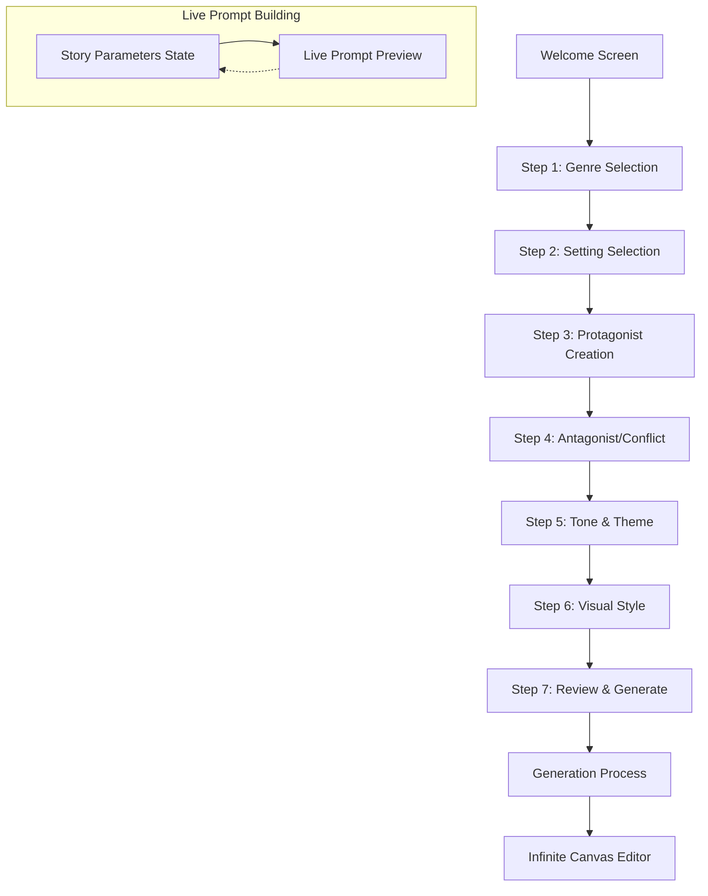
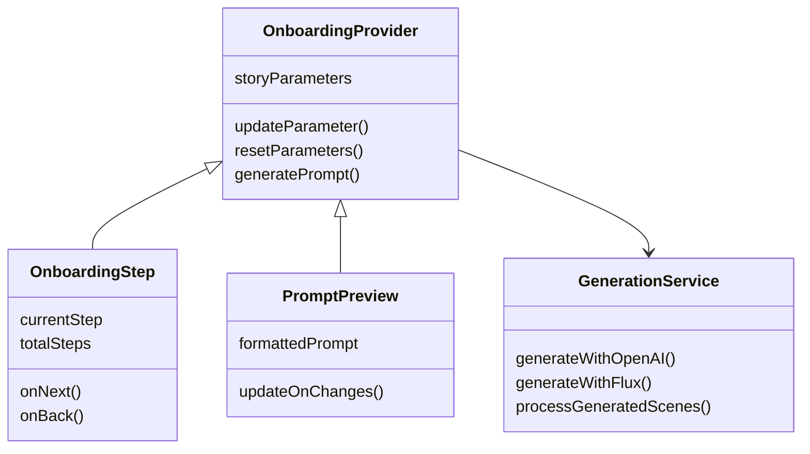

# AI MovieMaker Onboarding Flow Implementation Plan

## 1. Overview

This document outlines the implementation plan for the AI MovieMaker onboarding flow that guides users through story creation before accessing the infinite canvas editor. The onboarding process collects narrative elements step-by-step to build a comprehensive prompt, which is then used to generate initial scenes for the editor.



## 2. Component Architecture

### Core Structure



## 3. Implementation Details

### 3.1 Project Structure Updates

```
/src
  /components
    /onboarding
      OnboardingLayout.tsx        # Wrapper layout with progress indicator
      WelcomeScreen.tsx           # Initial welcome/choice screen
      GenreSelection.tsx          # Step 1: Genre selection
      SettingSelection.tsx        # Step 2: Setting selection
      ProtagonistCreation.tsx     # Step 3: Protagonist definition
      AntagonistCreation.tsx      # Step 4: Antagonist/conflict
      ToneThemeSelection.tsx      # Step 5: Tone & theme
      VisualStyleSelection.tsx    # Step 6: Visual style
      ReviewGenerate.tsx          # Step 7: Review and generate
      GenerationProcess.tsx       # Loading/generation screen
    /ui
      PromptPreview.tsx           # Live prompt preview component
      OptionPill.tsx              # Reusable selection pill component
      DetailInput.tsx             # Text input for additional details
      StoryStructureOptions.tsx   # Chapter/scene configuration UI
      ProgressSteps.tsx           # Step progress indicator
  /contexts
    OnboardingContext.tsx         # State management for story parameters
  /lib
    promptBuilder.ts              # Functions to build AI prompts
    storyStructure.ts             # Story structure utilities
  /services
    openaiService.ts              # OpenAI integration
    fluxService.ts                # Flux model integration
    sceneGenerator.ts             # Scene generation orchestrator
  /app
    /page.tsx                     # Root page (Welcome screen)
    /onboarding
      /layout.tsx                 # Shared onboarding layout
      /step/[step]/page.tsx       # Step pages (dynamic route)
    /generating
      /page.tsx                   # Generation process page
```

### 3.2 Data Model and State Management

#### Story Parameters

```typescript
interface StoryParameters {
  // Basic story elements
  genre: string;
  genreDetails?: string;
  setting: string;
  settingDetails?: string;
  timeframe?: string;
  protagonist: string;
  protagonistDetails?: string;
  antagonist: string;
  antagonistDetails?: string;
  conflict?: string;
  
  // Stylistic elements
  tone: string; // e.g., "dark", "upbeat", "whimsical"
  theme?: string;
  visualStyle: string; // e.g., "realistic", "animated", "noir"
  visualStyleDetails?: string;
  colorPalette?: string;
  
  // Structure configuration
  storyStructure: {
    chapterCount: number; // 3-5
    scenesPerChapter: number; // 2-4
    pacing?: string; // e.g., "fast", "medium", "slow"
  };
  
  // Model preference
  preferredModel?: 'openai' | 'flux' | 'both';
}
```

#### Context Provider Implementation

```typescript
// OnboardingContext.tsx
import React, { createContext, useState, useContext } from 'react';

interface OnboardingContextType {
  storyParameters: StoryParameters;
  updateParameter: (key: keyof StoryParameters | string, value: any) => void;
  updateNestedParameter: (parent: string, key: string, value: any) => void;
  resetParameters: () => void;
  generatePrompt: () => string;
  getCurrentStep: () => number;
}

const defaultStoryParameters: StoryParameters = {
  genre: '',
  setting: '',
  protagonist: '',
  antagonist: '',
  tone: '',
  visualStyle: '',
  storyStructure: {
    chapterCount: 3,
    scenesPerChapter: 3,
    pacing: 'medium'
  },
  preferredModel: 'both'
};

const OnboardingContext = createContext<OnboardingContextType | undefined>(undefined);

export const OnboardingProvider: React.FC<{ children: React.ReactNode }> = ({ children }) => {
  const [storyParameters, setStoryParameters] = useState<StoryParameters>(defaultStoryParameters);

  const updateParameter = (key: keyof StoryParameters | string, value: any) => {
    setStoryParameters(prev => ({
      ...prev,
      [key]: value
    }));
  };

  const updateNestedParameter = (parent: string, key: string, value: any) => {
    setStoryParameters(prev => ({
      ...prev,
      [parent]: {
        ...prev[parent as keyof StoryParameters],
        [key]: value
      }
    }));
  };

  const resetParameters = () => {
    setStoryParameters(defaultStoryParameters);
  };

  const generatePrompt = () => {
    // Implemented in promptBuilder.ts
    // This will call the external function but is included in context for convenience
    return buildPromptFromParameters(storyParameters);
  };

  const getCurrentStep = () => {
    // Determine current step based on filled parameters
    // This helps with navigation and progress tracking
    // Logic to be implemented
  };

  return (
    <OnboardingContext.Provider
      value={{
        storyParameters,
        updateParameter,
        updateNestedParameter,
        resetParameters,
        generatePrompt,
        getCurrentStep
      }}
    >
      {children}
    </OnboardingContext.Provider>
  );
};

export const useOnboarding = () => {
  const context = useContext(OnboardingContext);
  if (!context) {
    throw new Error('useOnboarding must be used within OnboardingProvider');
  }
  return context;
};
```

### 3.3 Prompt Building Logic

```typescript
// promptBuilder.ts
import { StoryParameters } from '@/types';

export function buildPromptFromParameters(params: StoryParameters): string {
  let prompt = `Create a ${params.tone} ${params.genre} story`;
  
  if (params.genreDetails) {
    prompt += ` with ${params.genreDetails}`;
  }
  
  prompt += ` set in ${params.setting}`;
  
  if (params.settingDetails) {
    prompt += ` characterized by ${params.settingDetails}`;
  }
  
  if (params.timeframe) {
    prompt += ` during ${params.timeframe}`;
  }
  
  prompt += `. The protagonist is ${params.protagonist}`;
  
  if (params.protagonistDetails) {
    prompt += ` who ${params.protagonistDetails}`;
  }
  
  prompt += `. The antagonist is ${params.antagonist}`;
  
  if (params.antagonistDetails) {
    prompt += ` who ${params.antagonistDetails}`;
  }
  
  if (params.conflict) {
    prompt += `. The central conflict involves ${params.conflict}`;
  }
  
  prompt += `. The theme explores ${params.theme || 'themes of conflict and resolution'}`;
  
  prompt += `. Visualize this in a ${params.visualStyle} style`;
  
  if (params.visualStyleDetails) {
    prompt += ` with ${params.visualStyleDetails}`;
  }
  
  if (params.colorPalette) {
    prompt += `. Use a color palette that is ${params.colorPalette}`;
  }
  
  return prompt;
}

export function generateChapterPrompts(basePrompt: string, params: StoryParameters): string[] {
  const chapterCount = params.storyStructure.chapterCount;
  const chapters: string[] = [];
  
  // Generate chapter-specific prompts
  for (let i = 0; i < chapterCount; i++) {
    let chapterPrompt = basePrompt;
    
    if (i === 0) {
      chapterPrompt += `. This is the beginning of the story, establishing the setting and introducing the protagonist.`;
    } else if (i === chapterCount - 1) {
      chapterPrompt += `. This is the conclusion of the story, resolving the central conflict.`;
    } else {
      chapterPrompt += `. This is chapter ${i + 1} where the conflict develops and escalates.`;
    }
    
    chapters.push(chapterPrompt);
  }
  
  return chapters;
}

export function generateScenePrompts(chapterPrompt: string, scenesPerChapter: number, chapterIndex: number): string[] {
  const scenes: string[] = [];
  
  for (let i = 0; i < scenesPerChapter; i++) {
    let scenePrompt = chapterPrompt;
    
    if (chapterIndex === 0) {
      // First chapter scenes
      if (i === 0) {
        scenePrompt += ` This is the opening scene that establishes the world and introduces the protagonist.`;
      } else if (i === scenesPerChapter - 1) {
        scenePrompt += ` This scene ends the first chapter with the protagonist encountering the first challenge.`;
      } else {
        scenePrompt += ` This scene develops the protagonist's character and hints at the coming conflict.`;
      }
    } else if (chapterIndex === 1) {
      // Middle chapter scenes
      if (i === 0) {
        scenePrompt += ` This scene shows the protagonist dealing with growing challenges.`;
      } else if (i === scenesPerChapter - 1) {
        scenePrompt += ` This scene escalates the conflict significantly.`;
      } else {
        scenePrompt += ` This scene reveals more about the antagonist and raises the stakes.`;
      }
    } else {
      // Final chapter scenes
      if (i === 0) {
        scenePrompt += ` This scene shows the protagonist preparing for the final confrontation.`;
      } else if (i === scenesPerChapter - 1) {
        scenePrompt += ` This is the final scene that resolves the story and shows the aftermath.`;
      } else {
        scenePrompt += ` This scene contains the climactic confrontation between protagonist and antagonist.`;
      }
    }
    
    scenes.push(scenePrompt);
  }
  
  return scenes;
}
```

### 3.4 AI Model Integration

```typescript
// openaiService.ts
import OpenAI from 'openai';

const openai = new OpenAI({
  apiKey: process.env.OPENAI_API_KEY
});

export async function generateImageWithOpenAI(prompt: string): Promise<string> {
  try {
    const response = await openai.images.generate({
      prompt,
      n: 1,
      size: "1024x1024",
      response_format: "url"
    });
    
    return response.data[0].url;
  } catch (error) {
    console.error("OpenAI generation error:", error);
    throw new Error("Failed to generate image with OpenAI");
  }
}

// fluxService.ts
export async function generateImageWithFlux(prompt: string): Promise<string> {
  try {
    const response = await fetch('https://api.replicate.com/v1/predictions', {
      method: 'POST',
      headers: {
        'Authorization': `Token ${process.env.REPLICATE_API_TOKEN}`,
        'Content-Type': 'application/json',
      },
      body: JSON.stringify({
        version: "black-forest-labs/flux-schnell",
        input: {
          prompt,
          go_fast: true,
          megapixels: "1",
          num_outputs: 1,
          aspect_ratio: "1:1",
          output_format: "webp",
          output_quality: 80,
          num_inference_steps: 4
        }
      }),
    });
    
    const prediction = await response.json();
    
    // Poll for completion
    let pollResponse = await fetch(`https://api.replicate.com/v1/predictions/${prediction.id}`, {
      headers: {
        'Authorization': `Token ${process.env.REPLICATE_API_TOKEN}`,
      },
    });
    
    let pollResult = await pollResponse.json();
    
    while (pollResult.status !== "succeeded" && pollResult.status !== "failed") {
      await new Promise(resolve => setTimeout(resolve, 1000));
      pollResponse = await fetch(`https://api.replicate.com/v1/predictions/${prediction.id}`, {
        headers: {
          'Authorization': `Token ${process.env.REPLICATE_API_TOKEN}`,
        },
      });
      pollResult = await pollResponse.json();
    }
    
    if (pollResult.status === "failed") {
      throw new Error("Flux generation failed");
    }
    
    return pollResult.output[0]; // URL to the generated image
  } catch (error) {
    console.error("Flux generation error:", error);
    throw new Error("Failed to generate image with Flux");
  }
}

// sceneGenerator.ts
import { StoryParameters } from '@/types';
import { buildPromptFromParameters, generateChapterPrompts, generateScenePrompts } from '@/lib/promptBuilder';
import { generateImageWithOpenAI } from './openaiService';
import { generateImageWithFlux } from './fluxService';

export async function generateScenes(parameters: StoryParameters): Promise<SceneData[]> {
  const basePrompt = buildPromptFromParameters(parameters);
  const chapterPrompts = generateChapterPrompts(basePrompt, parameters);
  const scenes: SceneData[] = [];
  
  // Process each chapter
  for (let chapterIndex = 0; chapterIndex < chapterPrompts.length; chapterIndex++) {
    const chapterPrompt = chapterPrompts[chapterIndex];
    const scenePrompts = generateScenePrompts(
      chapterPrompt, 
      parameters.storyStructure.scenesPerChapter,
      chapterIndex
    );
    
    // Generate images for each scene
    for (let sceneIndex = 0; sceneIndex < scenePrompts.length; sceneIndex++) {
      const scenePrompt = scenePrompts[sceneIndex];
      
      let imageUrl = '';
      
      // Use preferred model, or fall back to both
      if (parameters.preferredModel === 'openai') {
        imageUrl = await generateImageWithOpenAI(scenePrompt);
      } else if (parameters.preferredModel === 'flux') {
        imageUrl = await generateImageWithFlux(scenePrompt);
      } else {
        // Try OpenAI first, fall back to Flux if it fails
        try {
          imageUrl = await generateImageWithOpenAI(scenePrompt);
        } catch (error) {
          console.error("OpenAI failed, trying Flux:", error);
          imageUrl = await generateImageWithFlux(scenePrompt);
        }
      }
      
      scenes.push({
        id: `${chapterIndex + 1}-${sceneIndex + 1}`,
        prompt: scenePrompt,
        imageUrl: imageUrl,
        position: {
          x: 100 + (chapterIndex * 400),
          y: 100 + (sceneIndex * 250)
        },
        chapter: chapterIndex + 1,
        scene: sceneIndex + 1
      });
    }
  }
  
  return scenes;
}
```

### 3.5 Component Implementation Example: GenreSelection

```tsx
// GenreSelection.tsx
'use client';

import { useState, useEffect } from 'react';
import { useRouter } from 'next/navigation';
import { useOnboarding } from '@/contexts/OnboardingContext';
import OptionPill from '@/components/ui/OptionPill';
import DetailInput from '@/components/ui/DetailInput';
import PromptPreview from '@/components/ui/PromptPreview';
import ProgressSteps from '@/components/ui/ProgressSteps';

const genreOptions = [
  'Sci-Fi', 'Fantasy', 'Drama', 'Horror', 'Rom-Com', 
  'Superhero', 'Mystery', 'Noir', 'Western', 'Anime'
];

export default function GenreSelection() {
  const router = useRouter();
  const { storyParameters, updateParameter } = useOnboarding();
  const [selectedGenre, setSelectedGenre] = useState(storyParameters.genre || '');
  const [genreDetails, setGenreDetails] = useState(storyParameters.genreDetails || '');
  
  const handleGenreSelect = (genre: string) => {
    setSelectedGenre(genre);
    updateParameter('genre', genre);
  };
  
  const handleDetailsChange = (e: React.ChangeEvent<HTMLInputElement>) => {
    setGenreDetails(e.target.value);
    updateParameter('genreDetails', e.target.value);
  };
  
  const handleNext = () => {
    if (selectedGenre) {
      router.push('/onboarding/step/2');
    }
  };
  
  return (
    <div className="step-container">
      <ProgressSteps currentStep={1} totalSteps={7} />
      
      <h2 className="step-header">Let's start with a genre.</h2>
      
      <div className="genre-options">
        {genreOptions.map(genre => (
          <OptionPill
            key={genre}
            label={genre}
            selected={selectedGenre === genre}
            onClick={() => handleGenreSelect(genre)}
          />
        ))}
      </div>
      
      <DetailInput
        label="Add your own twist"
        placeholder="e.g., 1960s retro-futuristic sci-fi noir"
        value={genreDetails}
        onChange={handleDetailsChange}
        hint="Give us more flavor—optional but fun."
      />
      
      <PromptPreview />
      
      <div className="navigation-buttons">
        <button 
          className="back-button"
          onClick={() => router.push('/')}
        >
          Back
        </button>
        
        <button 
          className="next-button"
          onClick={handleNext}
          disabled={!selectedGenre}
        >
          Next
        </button>
      </div>
    </div>
  );
}
```

### 3.6 Generation Process Screen Implementation

```tsx
// GenerationProcess.tsx
'use client';

import { useState, useEffect } from 'react';
import { useRouter } from 'next/navigation';
import { useOnboarding } from '@/contexts/OnboardingContext';
import { generateScenes } from '@/services/sceneGenerator';

export default function GenerationProcess() {
  const router = useRouter();
  const { storyParameters } = useOnboarding();
  const [status, setStatus] = useState('Initializing...');
  const [progress, setProgress] = useState(0);
  const [logs, setLogs] = useState<string[]>([]);
  
  const addLog = (message: string) => {
    setLogs(prev => [...prev, message]);
  };
  
  useEffect(() => {
    const generateContent = async () => {
      try {
        setStatus('Building your story world...');
        setProgress(10);
        addLog('Analyzing story parameters...');
        
        // Small delay for UX
        await new Promise(r => setTimeout(r, 800));
        
        setStatus('Crafting your narrative...');
        setProgress(25);
        addLog('Creating chapter framework...');
        
        await new Promise(r => setTimeout(r, 800));
        
        setStatus('Designing your characters...');
        setProgress(40);
        addLog(`Developing ${storyParameters.protagonist} character profile...`);
        
        await new Promise(r => setTimeout(r, 800));
        
        setStatus('Generating scenes...');
        setProgress(60);
        addLog('Starting image generation process...');
        
        // Actual generation
        const scenes = await generateScenes(storyParameters);
        
        addLog(`Created ${scenes.length} scenes across ${storyParameters.storyStructure.chapterCount} chapters.`);
        
        setStatus('Finalizing your story...');
        setProgress(90);
        
        // Store generated scenes
        localStorage.setItem('generatedScenes', JSON.stringify(scenes));
        
        await new Promise(r => setTimeout(r, 800));
        
        setStatus('Complete!');
        setProgress(100);
        addLog('Story successfully generated!');
        
        // Navigate to editor with generated scenes
        await new Promise(r => setTimeout(r, 1000));
        router.push('/editor');
        
      } catch (error) {
        console.error("Generation error:", error);
        setStatus('Error generating content');
        addLog(`Error: ${error.message}`);
      }
    };
    
    generateContent();
  }, []);
  
  return (
    <div className="generation-container">
      <h1>Generating Your Story</h1>
      
      <div className="progress-container">
        <div className="progress-bar">
          <div 
            className="progress-fill"
            style={{ width: `${progress}%` }}
          />
        </div>
        <div className="progress-status">{status}</div>
      </div>
      
      <div className="logs-container">
        <h3>Generation Log</h3>
        <div className="logs-window">
          {logs.map((log, index) => (
            <div key={index} className="log-entry">
              {log}
            </div>
          ))}
        </div>
      </div>
    </div>
  );
}
```

### 3.7 Integration with Infinite Canvas

```tsx
// Update to MovieEditor.tsx
import { useEffect, useState } from 'react';
// Other imports...

export default function MovieEditor() {
  const [scenes, setScenes] = useState<SceneData[]>([]);
  const [selectedSceneId, setSelectedSceneId] = useState<string>('');
  
  useEffect(() => {
    // Load generated scenes from local storage if available
    const storedScenes = localStorage.getItem('generatedScenes');
    
    if (storedScenes) {
      try {
        const parsedScenes = JSON.parse(storedScenes);
        setScenes(parsedScenes);
        
        if (parsedScenes.length > 0) {
          setSelectedSceneId(parsedScenes[0].id);
        }
      } catch (error) {
        console.error('Error parsing stored scenes:', error);
      }
    }
  }, []);
  
  // Rest of the editor implementation
  // ...
}
```

## 4. Implementation Timeline

### Phase 1: Foundation (Week 1)
- Set up project structure and routes
- Implement OnboardingContext and state management
- Create base UI components (OptionPill, PromptPreview, etc.)
- Build navigation system between steps

### Phase 2: Step Implementation (Week 2)
- Implement all onboarding step components
- Create prompt builder utilities
- Develop the Review & Generate screen with story structure options

### Phase 3: AI Integration (Week 3)
- Set up OpenAI and Flux service integrations
- Create scene generation logic
- Implement Generation Process screen
- Connect generated scenes to Infinite Canvas editor

### Phase 4: Testing & Refinement (Week 4)
- End-to-end testing
- User experience improvements
- Performance optimization
- Documentation

## 5. Key Considerations

### Accessibility
- All components should be fully keyboard navigable
- Proper ARIA attributes for screen readers
- Adequate color contrast for readability

### Performance
- Lazy loading of step components
- Optimized state management
- Efficient API calls to AI services

### Error Handling
- Graceful degradation if AI generation fails
- Retry mechanisms for network issues
- Clear user feedback on errors

### Future Expansion
- Code structure supports adding "Upload Story" path later
- Modular design allows for additional AI models
- Story parameters can be extended for more detailed control