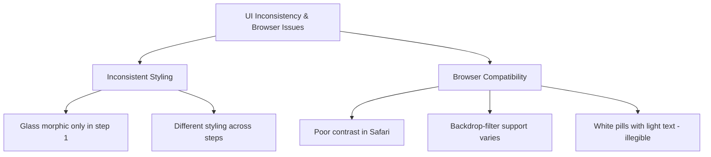
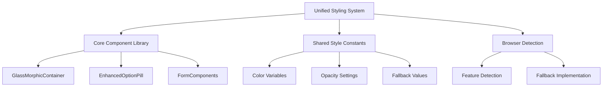
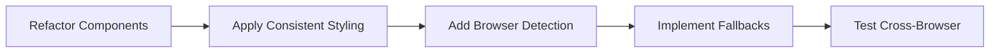

# Consistent Cross-Browser UI Enhancement Plan for AI MovieMaker

Based on your feedback, I understand that we need to address two key issues:

1. **Inconsistent styling across form steps** - The glass morphic style is only applied to step 1
2. **Poor browser compatibility** - The styling looks good in Chrome but has contrast issues in Safari

This plan details how we'll create a consistent, cross-browser compatible UI with appropriate fallbacks.

## Current Issues



## Proposed Solutions

### 1. Create Unified Styling Architecture



### 2. Component-Level Enhancements

#### For All Components:
- Create browser detection utility to check support for `backdrop-filter`
- Implement consistent fallbacks for browsers without proper support
- Apply dark backgrounds with adequate opacity for text readability

#### Specific Component Updates:

**GlassMorphicContainer:**
- Enhanced with feature detection for backdrop-filter
- Solid dark fallbacks for browsers without support
- Apply consistently to ALL form steps and components

**OptionPills:**
- Update to use dark backgrounds in all browsers
- Ensure high contrast between text and background
- Consistent styling for selected and unselected states

**Input Fields & Form Elements:**
- Increase background opacity for better text contrast
- Add visible borders for better definition
- Ensure consistent styling across all form steps

**Prompt Preview:**
- Standardize on dark background with adequate opacity
- Implement table formatting with proper spacing
- Maintain consistent appearance across all steps

### 3. Implementation Strategy



#### Step 1: Create Browser Detection Utility
```javascript
// src/lib/browserUtils.ts
export const supportsCssBackdropFilter = (): boolean => {
  if (typeof window === 'undefined') return false;
  return 'CSS' in window && CSS.supports('backdrop-filter', 'blur(10px)');
};
```

#### Step 2: Update GlassMorphicContainer with Fallbacks
```javascript
// src/components/ui/GlassMorphicContainer.tsx
const GlassMorphicContainer = ({ children, className = '', intense = false }) => {
  // Use React hook in actual implementation
  const [supportsBlur, setSupportsBlur] = useState(true);
  
  useEffect(() => {
    setSupportsBlur(supportsCssBackdropFilter());
  }, []);
  
  const baseClasses = "rounded-xl shadow-lg border border-white/10";
  
  // Different styles based on feature support
  const backgroundClasses = supportsBlur 
    ? intense 
      ? "bg-black/40 backdrop-blur-md" 
      : "bg-black/30 backdrop-blur-sm"
    : intense
      ? "bg-black/70" // Solid fallback for intense
      : "bg-black/50"; // Solid fallback for normal
  
  return (
    <div className={`${baseClasses} ${backgroundClasses} ${className}`}>
      {children}
    </div>
  );
};
```

#### Step 3: Update EnhancedOptionPill Component
```javascript
// src/components/ui/EnhancedOptionPill.tsx
const EnhancedOptionPill = ({ label, selected, onClick }) => {
  // Always use darker backgrounds regardless of browser
  const unselectedClasses = "bg-black/50 text-white hover:bg-black/60 border border-white/20";
  const selectedClasses = "bg-blue-600/90 text-white border border-blue-400/30";
  
  return (
    <button
      onClick={onClick}
      className={`px-4 py-2 rounded-full transition-colors ${selected ? selectedClasses : unselectedClasses}`}
    >
      {label}
    </button>
  );
};
```

#### Step 4: Update Form Input Components
```javascript
// src/components/ui/EnhancedDetailInput.tsx
const EnhancedDetailInput = ({ label, placeholder, value, onChange, hint }) => {
  return (
    <div className="mb-4">
      <label className="block text-sm font-medium text-white mb-1">{label}</label>
      <input
        type="text"
        placeholder={placeholder}
        value={value}
        onChange={onChange}
        className="w-full p-3 border border-white/30 rounded-md text-sm bg-black/50 text-white placeholder-white/50 focus:outline-none focus:ring-2 focus:ring-blue-500"
      />
      {hint && <p className="mt-1 text-xs text-white/70">{hint}</p>}
    </div>
  );
};
```

#### Step 5: Update TablePromptPreview
```javascript
// src/components/ui/TablePromptPreview.tsx
const TablePromptPreview = () => {
  // Component implementation
  return (
    <div className="bg-black/60 rounded-md p-4 border border-white/20">
      <h3 className="text-white font-medium mb-3">Prompt Preview:</h3>
      <table className="w-full">
        {/* Table content */}
      </table>
    </div>
  );
};
```

### 4. Applying Consistent Styling Across All Steps

1. Identify all step components and ensure they use the same base components:
   - GenreSelection
   - SettingSelection
   - ProtagonistCreation
   - AntagonistCreation
   - ToneThemeSelection
   - VisualStyleSelection
   - ReviewGenerate

2. Update each to use our enhanced components with proper styling:
   - Replace standard containers with GlassMorphicContainer
   - Replace standard option pills with EnhancedOptionPills
   - Update all form inputs with consistent styling
   - Ensure TablePromptPreview is used consistently

3. Create shared wrapper component for step content:
```javascript
// src/components/ui/StepContainer.tsx
const StepContainer = ({ children, title, currentStep, totalSteps }) => {
  return (
    <GlassMorphicContainer className="max-w-md w-full mx-auto p-8">
      <EnhancedProgressSteps currentStep={currentStep} totalSteps={totalSteps} />
      <h2 className="text-xl font-bold text-white mb-6">{title}</h2>
      {children}
    </GlassMorphicContainer>
  );
};
```

### 5. Testing Across Browsers

- Test on Chrome, Safari, Firefox, and Edge
- Verify readability on mobile devices
- Check for consistent appearance across all form steps
- Create browser-specific screenshots for comparison

## Expected Outcomes

1. Consistent glass morphic styling across all form steps
2. Good contrast and readability in all browsers
3. Elegant fallbacks where advanced CSS features aren't supported
4. Unified component library that maintains visual consistency

This plan ensures that the AI MovieMaker application will provide a visually consistent, accessible experience regardless of browser, while maintaining the attractive glass morphic design where supported.