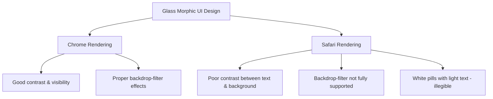
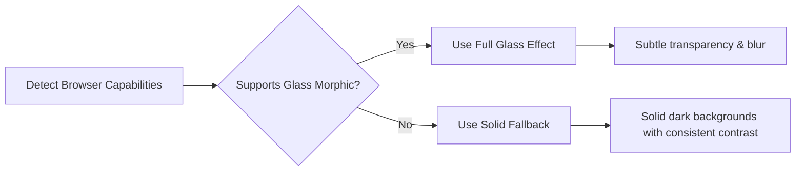
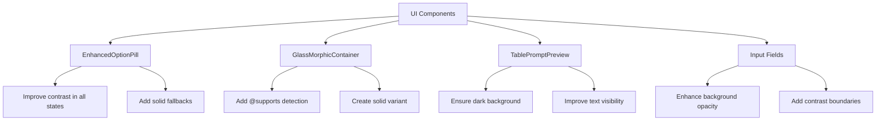

# Cross-Browser Compatible UI Enhancement Plan for AI MovieMaker

Based on the screenshots and feedback, I can see we have browser compatibility issues with our glass morphic design. What looks good in Chrome has poor contrast in Safari, making text illegible. This plan addresses those issues to ensure consistent appearance and readability across all browsers.

## Current Issues



## Proposed Solutions

### 1. Cross-Browser Feature Detection & Fallbacks



#### Implementation Details:
- Create a browser feature detection utility to check support for `backdrop-filter`
- Implement CSS fallbacks using `@supports` queries
- Ensure all components have fallback styles for non-supporting browsers

### 2. Color Scheme & Contrast Enhancements

#### For Option Pills:
- **Selected State**: Dark background (bg-blue-600/90 or bg-black/70) with white text
- **Unselected State**: Semi-transparent dark background (bg-black/40) with white text
- Add contrast boundary (subtle border) to ensure visibility regardless of background

#### For Input Fields & Prompt Preview:
- Always use solid dark backgrounds (bg-black/70) instead of fully transparent ones
- Maintain high contrast between text and background (white text on dark backgrounds)
- Add solid borders to delineate edges when blur effects aren't available

### 3. Component-Specific Updates



### 4. Implementation Steps

1. **Create Browser Detection Utility**
   ```javascript
   // src/lib/browserUtils.ts
   export const supportsCssBackdropFilter = (): boolean => {
     if (typeof window === 'undefined') return false;
     return 'CSS' in window && CSS.supports('backdrop-filter', 'blur(10px)');
   };
   ```

2. **Update Base Components**
   - Modify `GlassMorphicContainer` to include fallback styles:
   ```jsx
   // Enhanced GlassMorphicContainer with fallbacks
   const GlassMorphicContainer = ({ children, className = '', intense = false }) => {
     // In real implementation, this would be a React hook or context value
     const supportsBlur = supportsCssBackdropFilter();
     
     const baseClasses = "rounded-xl shadow-lg border border-white/10";
     
     // Different styles based on feature support
     const backgroundClasses = supportsBlur 
       ? intense 
         ? "bg-black/40 backdrop-blur-md" 
         : "bg-black/30 backdrop-blur-sm"
       : intense
         ? "bg-black/70" // Solid fallback for intense
         : "bg-black/50"; // Solid fallback for normal
     
     return (
       <div className={`${baseClasses} ${backgroundClasses} ${className}`}>
         {children}
       </div>
     );
   };
   ```

3. **Enhance Option Pills**
   ```jsx
   // Enhanced option pill with better contrast
   const EnhancedOptionPill = ({ label, selected, onClick }) => {
     const supportsBlur = supportsCssBackdropFilter();
     
     // Always use darker backgrounds for unselected state
     const unselectedClasses = supportsBlur
       ? "bg-black/40 text-white border border-white/20"
       : "bg-black/60 text-white border border-white/20";
     
     // Use even darker or colored background for selected state
     const selectedClasses = "bg-blue-600/90 text-white border border-blue-400/40";
     
     return (
       <button
         onClick={onClick}
         className={`px-4 py-2 rounded-full ${selected ? selectedClasses : unselectedClasses}`}
       >
         {label}
       </button>
     );
   };
   ```

4. **Improve Table Prompt Preview**
   ```jsx
   // Enhanced TablePromptPreview with better contrast
   const TablePromptPreview = () => {
     // Component implementation
     return (
       <div className="bg-black/60 rounded-md p-4 border border-white/20">
         <h3 className="text-white font-medium mb-3">Prompt Preview:</h3>
         <table className="w-full">
