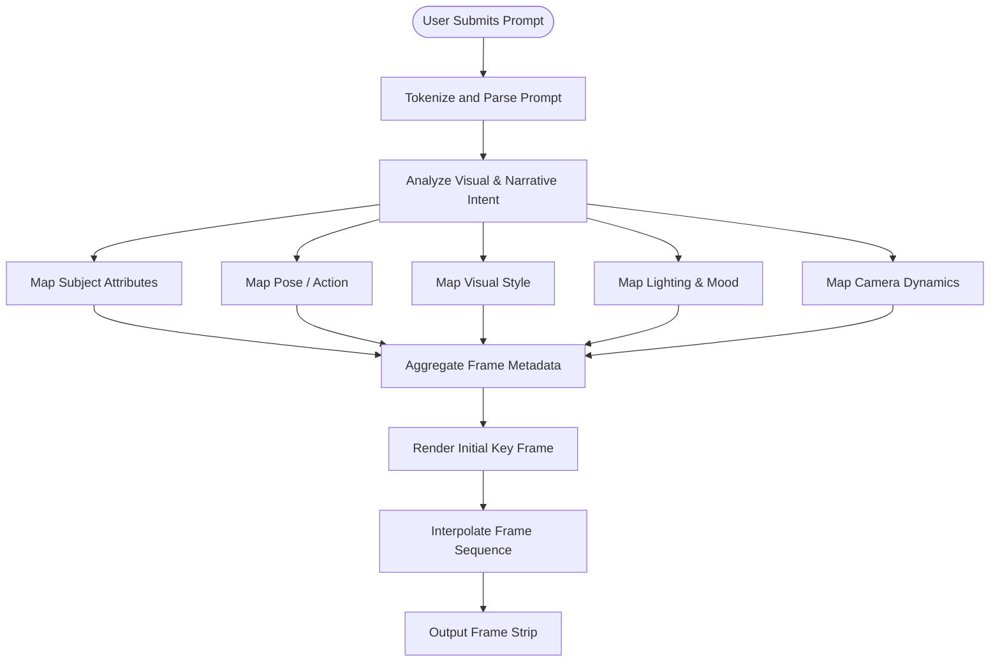
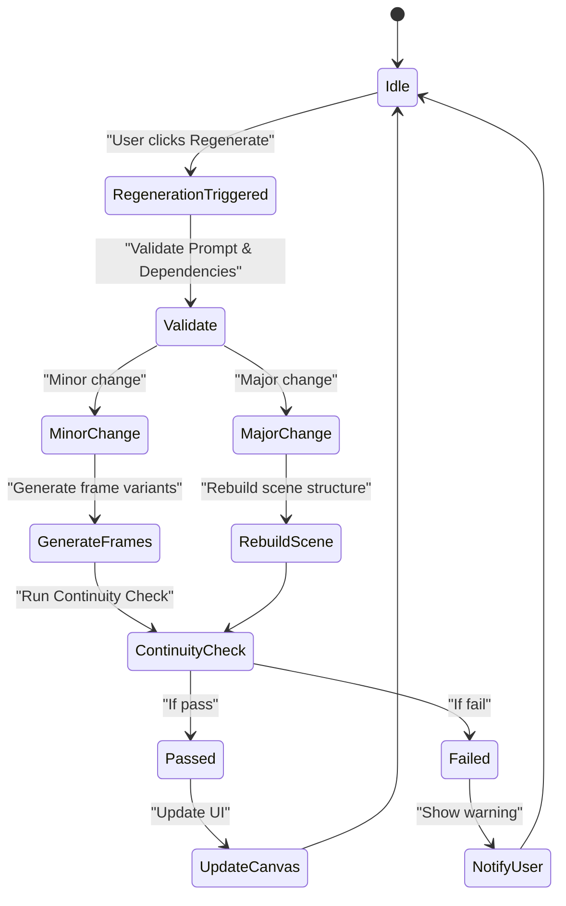
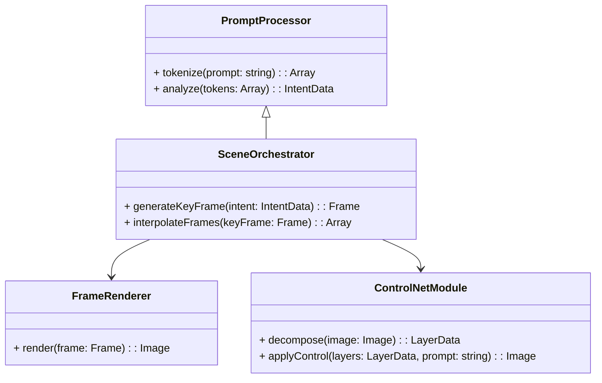
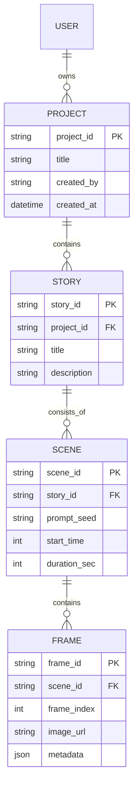

# Detailed Development Specification Document for AI MovieMaker

## 1. Introduction

**Product:** AI MovieMaker  
**Purpose:** To build an AI-driven movie generation application that enables users to create cinematic scenes and full-length narratives through an intuitive infinite canvas editor, advanced image generation (e.g., using Flux, OpenAI models), and ControlNet-based image decomposition for 3D scene rendering.  
**Audience:** Software architects, front-end and back-end developers, database engineers, QA engineers, and DevOps teams.

---

## 2. System Architecture Overview

### 2.1 High-Level Architecture
The system is divided into three major layers:
- **Frontend:** An interactive infinite canvas UI with onboarding, scene editing, prompt refinement, and timeline management.
- **Backend/API:** RESTful/GraphQL API to handle prompt processing, image generation orchestration, scene regeneration, and persistence.
- **AI Engine:** Integration with image generation models (Flux, OpenAI image gen) and ControlNet modules for layer decomposition, 3D reconstruction (via 3D Gaussian Splatting), and frame interpolation.

Below is a Mermaid diagram illustrating the high-level architecture:

```mermaid

flowchart TD
    A[User Frontend (Web App)]
    B[API Gateway]
    C[Backend Services]
    D[AI Generation Engine]
    E[ControlNet Module]
    F[3D Reconstruction Module]
    G[Database]
    A --> B
    B --> C
    C --> D
    D --> E
    D --> F
    C --> G

```

---
## 3. UML & Activity Diagrams

### 3.1 Prompt-to-Frame Dependency Mapping (Activity Diagram)



### 3.2 Scene Regeneration (State Machine Diagram)


---

### 3.3 Dependency Diagram (Class / Component) 



## 4. Database Model & Schema

### 4.1 Entity Relationship Diagram (ERD)



---
### 4.2 JSON Schema Example for Scene Data

Refer to the earlier JSON structure in the PRD. (See section 2 in the PRD for full details.)

## 5. Code Snippets & Logic Examples

### 5.1 Example: Prompt Tokenization (Python)

```python
def tokenize_prompt(prompt: str) -> list:
    tokens = prompt.split()
    return tokens

def analyze_prompt(tokens: list) -> dict:
    intent = {
        "subject": "unknown",
        "pose": "default",
        "style": "default",
        "lighting": "default",
        "camera": "default"
    }
    if "alien" in tokens:
        intent["subject"] = "alien"
    if "noir" in tokens:
        intent["style"] = "noir"
        intent["lighting"] = "low-light"
    return intent
    prompt = "A melancholic alien in a noir city"
    tokens = tokenize_prompt(prompt)
    intent_data = analyze_prompt(tokens)
    print(intent_data)
```

### 5.2 Example: Frame Interpolation Logic (Pseudocode)


```python

def generate_frame_sequence(key_frame, num_variations):
    frames = [key_frame]
    for i in range(1, num_variations):
        # Slightly modify camera angle, subject pose, etc.
        new_frame = adjust_frame(frames[-1], variation=i)
        frames.append(new_frame)
    return frames

def adjust_frame(frame, variation):
    # Example: add small increments to camera pan or subject position
    frame.metadata["camera_angle"] += 2 * variation
    frame.metadata["subject_pose"] = "updated"
    return frame
```    

## 6. User Stories & Acceptance Criteria

User Story 1: Onboarding and Prompt Generation
	•	Description: As a user, I want to input my story elements so that the system constructs a live prompt for scene generation.
	•	Acceptance Criteria:
	•	The user can select genre, setting, characters, and upload images.
	•	The live prompt preview updates in real time.
	•	The system saves the prompt data in the backend.
	•	Unit tests validate that tokenization and intent analysis functions produce expected outputs.

User Story 2: Infinite Canvas Scene Editor
	•	Description: As a user, I want to see a zoomed-in view of a scene with adjacent previews, edit prompts inline, and manage reference images.
	•	Acceptance Criteria:
	•	The zoomed-in view displays the main scene with peripheral previews.
	•	The prompt box is editable inline.
	•	Drag-and-drop functionality accepts up to 4 images.
	•	Timeline updates accordingly.
	•	Integration tests simulate user interactions and validate UI updates.

User Story 3: Scene Regeneration & Branching
	•	Description: As a user, I want to regenerate a scene and branch off alternate narrative arcs while preserving continuity.
	•	Acceptance Criteria:
	•	The regeneration logic executes with proper validation.
	•	Frame diff indicators display changes between versions.
	•	Key frame linkage viewer shows updated dependencies.
	•	Automated tests verify that continuity checks trigger warnings when expected.

⸻

## 7. Development Tasks & Sprint Breakdown

Sprint 1: Onboarding & Prompt Generation
	•	Build interactive onboarding flow and live prompt preview.
	•	Develop tokenization and intent analysis functions.
	•	Integrate basic UI wireframes for prompt editing.

Sprint 2: Infinite Canvas Editor
	•	Implement the zoomed-in and zoomed-out views.
	•	Build drag-and-drop image upload functionality.
	•	Integrate timeline and frame strip components.

Sprint 3: Scene Refinement Tools
	•	Develop key frame linkage viewer and branch functionality.
	•	Implement frame diff indicators.
	•	Create regeneration logic and UI feedback modules.

Sprint 4: AI Integration & ControlNet Layer
	•	Integrate image generation models (Flux, OpenAI) and ControlNet.
	•	Develop the per-frame scripting interface and 3D reconstruction pipeline.
	•	Implement real-time agent feedback.

Sprint 5: Testing, QA, and Beta Launch
	•	Write unit and integration tests for all modules.
	•	Perform user acceptance testing.
	•	Refine UI/UX based on beta feedback.
	•	Prepare deployment and scaling plans.

⸻

## 8. Additional Technical Considerations
	•	Scalability: Use cloud services (e.g., AWS, GCP) to host AI models and ensure horizontal scaling.
	•	Performance: Cache frequent prompt analysis results, optimize image generation pipelines.
	•	Security: Secure APIs, user authentication, and data encryption.
	•	Monitoring: Integrate logging and error reporting to monitor AI agent performance.
	•	Documentation: Maintain code documentation, API references, and developer guides.

⸻

This detailed development specification document is intended to provide a complete reference for your development team, covering architectural decisions, UML diagrams, database models, code examples, user stories with acceptance criteria, and a sprint breakdown.