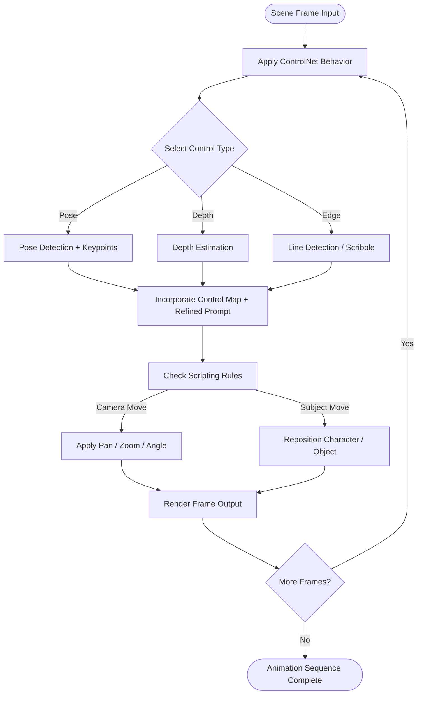

# Full Orchestration Logic

This flow maps:
	•	ControlNet layer selection and preprocessing
	•	Prompt conditioning and refinement
	•	Per-frame scripting (camera, subject)
	•	Frame-by-frame orchestration for animation consistency

