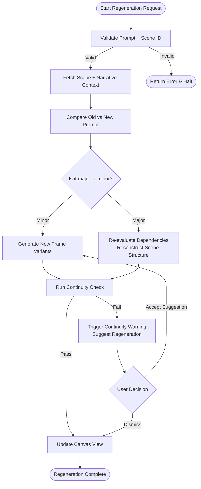

# Scene Regeneration Logic Flow

This diagram maps:
	•	Input validation
	•	Minor vs major prompt changes
	•	Control flow through frame generation, scene reconstruction, and continuity checks
	•	Error handling and user decision paths